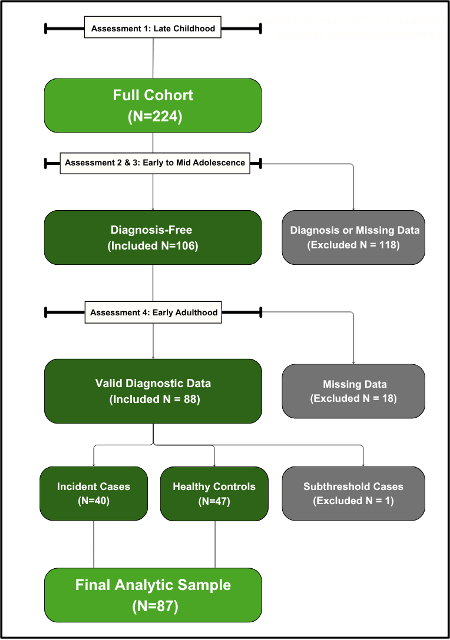

# els_diagnoses_data

## files

* **t1-t4 diagnostic data.csv** = current diagnosis at t1-t4, coded as 1 diagnosis, 0 no diagnosis: actual ksads variables i.e. no groupings
* **t5 diagnostic data.xlsx** = current diagnosis at t5, coded as 1 diagnosis, 0 no diagnosis; grouped as explained below
* **incidence_subsample.csv** = demographic and ed data for people healthy t1-t3 who received a diagnosis at t4 or t5; have to pull diagnosis labels from files above

## methods

structured clinical interviews were conducted at all four timepoints to assess the presence of a psychiatric diagnosis.

* at ages $\le 18$, participants completed the **schedule for affective disorders and schizophrenia for school-age children: present and lifetime version (k-sads-pl; kaufman et al., 1997)**, a semi-structured interview evaluating current and lifetime dsm-iv and dsm-5 disorders in children and adolescents.
* at ages $\ge 19$, participants completed the **structured clinical interview for dsm-5 (scid-5; first et al., 2015)** to assess current and lifetime psychiatric disorders.

interviews were conducted by trained assessors under the supervision of a clinician. for both interviews, diagnostic ratings followed a standardized 0-4 coding scheme:

| rating | definition |
| :--- | :--- |
| **0** | no information |
| **1** | not present |
| **2** | probable |
| **3** | partial remission |
| **4** | definite |

## diagnostic categories

we included diagnoses in this study that were assessed consistently across all four timepoints:

* depressive disorders
* anxiety disorders (including obsessive-compulsive and trauma-related disorders)
* bipolar and related disorders
* schizophrenia spectrum and other psychotic disorders
* substance use disorders
* eating disorders
* disruptive disorders

categories of major disorder were created by combining related sub-diagnoses (see table 1 of the supplement).

## incident diagnosis subsample

the full cohort (n=224) completed the k-sads at baseline. all participants entered the study free of lifetime psychiatric disorders, consistent with the study’s baseline exclusion criteria.

to identify participants who were diagnosed with a new-onset psychiatric disorder in early adulthood, an ‘incident diagnosis’ subsample was defined using the following criteria (see figure 1):

1.  **healthy at the first three assessments:** participants were considered healthy (diagnosis-free) through mid-adolescence (n=106; 47.3% of the full sample) if complete k-sads diagnostic data were available at each of the first three assessments and all current diagnoses were coded as 1 = not present across these timepoints (participants with ratings of 2 = probable or 3 = partial remission were excluded from analysis).
2.  **diagnostic classification at the last assessment:** of the 106 healthy participants, 88 had valid diagnostic data at the final assessment. incident cases were defined as participants who received a rating of 4 = definite for any psychiatric diagnosis (n=40), indicating the first onset of a psychiatric disorder between mid-adolescence and early adulthood. healthy controls were those with 1 = not present ratings for all diagnoses at all timepoints (n=47). one participant exhibited subthreshold symptoms (2 = probable) and was excluded from analyses, yielding a final analytic sample of n=87 consisting of incident cases (n=40; 46.0% of subsample) and healthy controls (n=47; 54.0%).

this classification avoids confounding with a concurrent psychiatric diagnosis. focusing on first-onset diagnoses in early adulthood provides a developmentally specific window for identifying antecedent rather than concurrent correlates of disorder onset. such a framing is consistent with prior findings that the timing of diagnosis onset is associated with distinct etiologic pathways, with earlier-onset cases linked to stronger neurodevelopmental and familial factors (jaffee et al., 2002) and later-onset disorders more often emerging in the context of ongoing maturation of regulatory systems (casey et al., 2019).

### inter-rater reliability

to assess inter-rater reliability of the diagnoses, we randomly selected five audio-recorded interviews from each timepoint (20 total) to be scored by a second trained interviewer who was blind to each participant’s identity and diagnostic history.

* there was 95-100% raw interrater agreement for all diagnoses.
* given that subthreshold and past ratings (e.g., 2 or 3) were excluded from the analytic sample, we also evaluated reliability focused on classifying diagnoses as absent versus present (e.g., 1 or 4).
* raters demonstrated high reliability, with gwet’s ac1 = 0.73, a stable chance-corrected estimate for dichotomous diagnostic classifications.

figure 1. flowchart of criteria for the final analytic sample.

  

